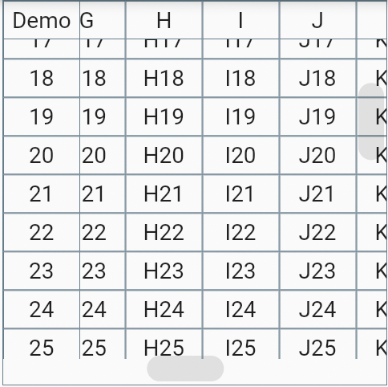
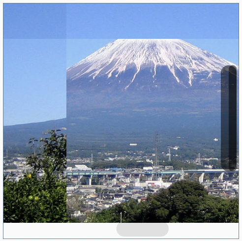

# FixedTitlesView

固定の列と行を残して2方向にスクロールする Widget のサンプルです。
[sticky-headers-table](https://github.com/AlexBacich/sticky-headers-table)
を参考にしましたが、違いは以下の通り。

- この Widget はセルのレイアウトをしていない。また、 onTap のハンドリングもしていない。画像などのテーブル以外の形のものを表示可能。
- 右と下にスクロールバーを表示する。

This sample is
a widget that scrolls in two directions, leaving fixed columns and rows. I borrowed some code from [sticky-headers-table](https://github.com/AlexBacich/sticky-headers-table) for this sample.

- This sample lacks cell layout and onTap handling. So you can show not only a table but also images, etc. in it.
- Add scroll bars.

